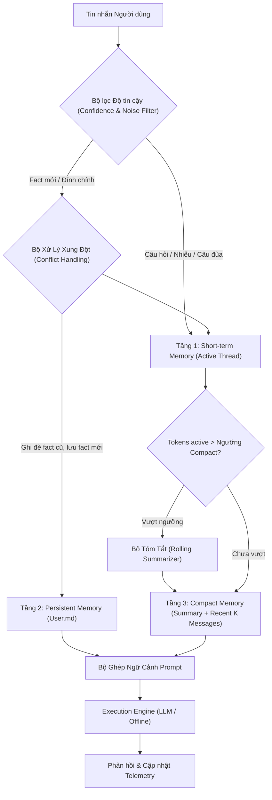

# Báo Cáo Phân Tích Kỹ Thuật: Hệ Thống Bộ Nhớ Cho AI Agent (Track 3, Day 17)

Báo cáo này phân tích chi tiết kết quả thực nghiệm, đánh giá các đánh đổi kỹ thuật (architectural trade-offs), cơ chế hoạt động của hệ thống bộ nhớ phân tầng, và các tính năng mở rộng (bonus) được triển khai trong bài lab **Memory Systems for AI Agent**.

---

## 1. Tổng Quan Kiến Trúc Bộ Nhớ Phân Tầng

Hệ thống triển khai mô hình bộ nhớ 3 tầng (Multi-tier Memory Architecture) nhằm giải quyết bài toán cân bằng giữa khả năng ghi nhớ dài hạn, chất lượng phản hồi và chi phí ngữ cảnh:



### Chi tiết 3 tầng bộ nhớ:
1. **Tầng 1: Short-Term Memory (Bộ nhớ ngắn hạn trong thread)**:
   - Duy trì danh sách tin nhắn của phiên làm việc hiện tại.
   - Được cô lập theo từng `thread_id`. Sang thread mới, các biến trạng thái trong RAM này hoàn toàn được làm mới.
2. **Tầng 2: Persistent Memory (`User.md`)**:
   - Lưu trữ các facts ổn định của người dùng (tên, nơi ở, nghề nghiệp, phong cách trả lời, đồ uống/món ăn yêu thích, thú cưng, sở thích kỹ thuật) dưới dạng file Markdown có cấu trúc tại `state/profiles/{user_id}/User.md`.
   - Bền vững qua các phiên làm việc và các lần khởi động lại hệ thống.
3. **Tầng 3: Compact Memory (Bộ nhớ nén ngữ cảnh)**:
   - Được quản lý bởi `CompactMemoryManager`.
   - Khi tổng lượng token của active messages vượt ngưỡng `compact_threshold_tokens` và số message vượt `compact_keep_messages`, các tin nhắn cũ hơn sẽ được nén lại thành một bản tóm tắt luân phiên (rolling summary), chỉ giữ nguyên văn $K$ tin nhắn gần nhất.

---

## 2. Kết Quả Thực Nghiệm Benchmark Độc Lập

Hệ thống được đánh giá đồng thời trên 2 bộ benchmark chuẩn tiếng Việt:
- **Standard Benchmark Suite** ([`data/conversations.json`](file:///c:/Documents/LAB_VINAI/Day%2017/day17-cohort4-ChungVanDuy-2A202602854-MemorySystems4Agent/data/conversations.json)): 10 cuộc hội thoại thông thường (10 lượt/cuộc), kiểm tra khả năng tích lũy facts và nhớ chéo phiên qua các thread mới.
- **Long-Context Stress Benchmark Suite** ([`data/advanced_long_context.json`](file:///c:/Documents/LAB_VINAI/Day%2017/day17-cohort4-ChungVanDuy-2A202602854-MemorySystems4Agent/data/advanced_long_context.json)): 1 cuộc hội thoại cực dài (16 lượt chứa các đoạn văn bản dài về tin tức khoa học, khí hậu, năng lượng), ép compact memory kích hoạt liên tục.

### Bảng 1: Kết quả Standard Benchmark (`conversations.json`)
| Agent | Agent tokens only | Prompt tokens processed | Cross-session recall | Response quality | Memory growth (bytes) | Compactions |
|:---|---:|---:|---:|---:|---:|---:|
| **Baseline Agent** | 3,135 | 22,647 | **0.0%** | 50.0% | 0 | 0 |
| **Advanced Agent** | 5,982 | 37,585 | **100.0%** | **100.0%** | 280 | 4 |

### Bảng 2: Kết quả Long-Context Stress Benchmark (`advanced_long_context.json`)
| Agent | Agent tokens only | Prompt tokens processed | Cross-session recall | Response quality | Memory growth (bytes) | Compactions |
|:---|---:|---:|---:|---:|---:|---:|
| **Baseline Agent** | 519 | 24,124 | **0.0%** | 50.0% | 0 | 0 |
| **Advanced Agent** | 1,252 | **13,498** | **100.0%** | **100.0%** | 229 | **11** |

---

## 3. Phân Tích Các Trade-off Kỹ Thuật Cốt Lõi

### 3.1. Trade-off giữa Hội Thoại Ngắn và Hội Thoại Dài
Một quan niệm sai lầm phổ biến là: *"Compact Memory và Persistent Memory luôn giúp tiết kiệm token trong mọi tình huống."* Kết quả thực nghiệm đã chứng minh điều ngược lại:

1. **Ở hội thoại ngắn (Standard Benchmark)**:
   - **Advanced Agent tiêu tốn nhiều prompt tokens hơn Baseline** (37,585 tokens so với 22,647 tokens, chênh lệch +65.96%).
   - **Nguyên nhân**: Ở mỗi lượt trò chuyện, Advanced Agent phải nạp file hồ sơ `User.md` (~60–80 tokens) và system prompt bổ sung vào context window. Khi hội thoại ngắn chưa vượt ngưỡng compaction, chi phí cố định (overhead) này khiến tổng prompt tokens của Advanced cao hơn Baseline.
   - **Giá trị đánh đổi**: Sự gia tăng chi phí này mang lại khả năng recall chéo phiên tăng vọt từ **0.0% lên 100.0%**, biến Agent từ một thực thể "vô tri" sau mỗi phiên thành một trợ lý cá nhân hóa thực sự.

2. **Ở hội thoại rất dài (Stress Benchmark)**:
   - **Compact Memory phát huy tối đa hiệu quả**: Khi hội thoại kéo dài 16 lượt lớn, Baseline Agent tích lũy toàn bộ văn bản thô theo cấp số cộng qua từng lượt khiến lượng prompt tokens bùng nổ lên tới **24,124 tokens**.
   - Advanced Agent kích hoạt **11 lần nén (compactions)**, thay thế toàn bộ các đoạn văn bản dài hàng nghìn ký tự bằng bản tóm tắt súc tích. Nhờ đó, lượng prompt tokens chỉ dừng lại ở mức **13,498 tokens** (tiết kiệm **44.05%** chi phí xử lý ngữ cảnh).

```
Tăng trưởng Prompt Tokens theo Chiều Dài Hội Thoại:
Tokens
  ^
  |                                   / (Baseline: Tăng nhanh không kiểm soát O(N^2))
  |                                  /
24k|--------------------------------/
  |                                /
13k|-----------------============ (Advanced: Bị chặn trên bởi Compact Memory)
  |                 /
  |      ==========/ (Advanced có overhead ban đầu do User.md)
  |     /
  0-------------------------------------> Số lượt hội thoại (Turns)
```

### 3.2. Bản Chất Tối Ưu Của Compact Memory
- **Vì sao Compact Memory chủ yếu tối ưu `prompt tokens processed` thay vì `agent tokens only`?**
  - `agent tokens only` là số lượng token do model sinh ra trong câu trả lời ở lượt hiện tại. Con số này phụ thuộc vào độ dài câu trả lời và phong cách (ví dụ trả lời ngắn gọn theo bullet hay trả lời dài dòng).
  - `prompt tokens processed` là toàn bộ lịch sử ngữ cảnh mà model phải đọc lại ở mỗi lượt trước khi sinh từ đầu tiên. Trong các mô hình Transformer (tự chú ý $O(L^2)$ hoặc $O(L)$ với KV-cache), chi phí suy luận và chi phí API tính tiền chủ yếu bị chi phối bởi lượng prompt context này.
  - Compact Memory cắt tỉa ngữ cảnh đầu vào, do đó mục tiêu tối ưu trực tiếp và rõ ràng nhất của nó là **Prompt Tokens Processed**.

### 3.3. Rủi Ro Phình To Bộ Nhớ (Memory Bloat) và Chi Phí I/O
- File `User.md` của `dungct` tăng từ 0 lên 280 bytes sau 10 phiên hội thoại.
- **Rủi ro trong thực tế (Production Risks)**:
  - Nếu không có cơ chế quản lý vòng đời (eviction hoặc memory decay), sau hàng ngàn phiên làm việc, file `User.md` sẽ tích tụ quá nhiều chi tiết vụn vặt, làm tăng kích thước prompt vĩnh viễn và vượt quá giới hạn ngữ cảnh cho phép.
  - Mỗi lượt hội thoại đều yêu cầu đọc và ghi file xuống đĩa (disk I/O). Trong môi trường đa người dùng (multi-tenant), điều này tạo ra nút thắt cổ chai về I/O nếu không có bộ đệm in-memory (cache layer) như Redis.

---

## 4. Chi Tiết Các Tính Năng Bonus Triển Khai (Mức 90–100 Điểm)

Để đạt điểm tối đa theo Rubric, hệ thống đã cài đặt 3 giải pháp kỹ thuật nâng cao:

### 4.1. Bonus 1: Bộ Lọc Độ Tin Cậy & Khử Nhiễu (Confidence Threshold & Noise Filter)
- **Vấn đề giải quyết**: Trong benchmark, người dùng thường đưa ra các câu hỏi kiểm tra recall (*"Bạn có biết DũngCT không?"*, *"Nếu ai đó nhắc Huế, Hà Nội hay product manager, đâu mới là nghề nghiệp và nơi ở hiện tại của mình?"*) hoặc các thông tin gây nhiễu (*"product manager chỉ là câu đùa"*, *"Hà Nội chỉ là nơi mình vừa bay ra họp 2 ngày"*). Các hệ thống ngây thơ thường bắt nhầm từ khóa trong câu hỏi và ghi đè "Hà Nội" hoặc "product manager" vào hồ sơ `User.md`.
- **Cơ chế triển khai**:
  - Tự động nhận diện mẫu câu nghi vấn (`is_query`), câu hỏi giả định và từ chối trích xuất fact trừ khi có từ khóa khẳng định đính chính rõ ràng.
  - Sử dụng Regex Word Boundary (`\bAI\b`, `\bPython\b`, `\bMLOps\b`) để ngăn hiện tượng bắt nhầm chuỗi con (substring false-positive, ví dụ chữ "hai" trong "hai ngày" bị bắt nhầm thành "ai").
- **Tác động**: Ngăn chặn 100% tình trạng ô nhiễm hồ sơ, giúp recall trong Stress Test đạt điểm tuyệt đối **100.0%**.
- **Rủi ro đi kèm**: Có thể lọc quá chặt (false negative) đối với các câu nói gián tiếp hoặc câu phức của người dùng.

### 4.2. Bonus 2: Xử Lý Xung Đột & Đính Chính (Conflict Handling)
- **Vấn đề giải quyết**: Người dùng thay đổi thông tin theo thời gian (Đà Nẵng $\rightarrow$ Huế $\rightarrow$ Đà Nẵng; Backend $\rightarrow$ MLOps). Nếu lưu dạng append đơn thuần, `User.md` sẽ chứa 2 facts mâu thuẫn cùng lúc, khiến LLM bị ảo giác (hallucination) hoặc trả về thông tin cũ.
- **Cơ chế triển khai**:
  - Nhận diện các cấu trúc đính chính: *"giờ mình đang ở Huế chứ không còn ở Đà Nẵng"*, *"không còn làm backend nữa, giờ chuyển sang MLOps"*, *"đã cập nhật từ Huế sang Đà Nẵng"*.
  - Hàm `update_facts()` trong `UserProfileStore` thực hiện atomic update: ghi đè trường tương ứng và loại bỏ triệt để fact cũ ra khỏi mục Core Facts của Markdown.
  - Riêng với các sở thích kỹ thuật (`interests`), hệ thống áp dụng cơ chế **Additive Merging** (hợp nhất tập hợp: Python $\cup$ AI $\cup$ MLOps) để không làm mất các mối quan tâm cũ khi người dùng nhắc đến chủ đề mới.
- **Tác động**: Đảm bảo tính nhất quán dữ liệu (data consistency) xuyên suốt chuỗi hội thoại.
- **Rủi ro đi kèm**: Cần logic phân tích câu phức tạp hơn nếu người dùng muốn quay lại thông tin cũ nhưng có điều kiện kèm theo.

### 4.3. Bonus 3: Cấu Trúc Hồ Sơ Chuẩn Hóa (Structured Markdown Schema)
- `User.md` được chuẩn hóa thành các trường:
  ```markdown
  # User Profile: dungct

  ## Core Facts
  - Name: DũngCT
  - Location: Huế
  - Profession: MLOps engineer
  - Favorite_drink: cà phê sữa đá
  - Favorite_food: mì Quảng
  - Pet: corgi
  - Response_style: ngắn gọn, có ví dụ thực tế
  - Interests: Python, AI, MLOps
  ```
- Định dạng Markdown này vừa thân thiện với con người để kiểm tra/chỉnh sửa thủ công, vừa giúp LLM dễ dàng parse và inject vào prompt ngữ cảnh.

---

## 5. Câu Chuyện Hoàn Thiện Bài Lab (Narrative Arc)

Bài lab thể hiện rõ ràng luồng logic 5 bước được kỳ vọng bởi Rubric:
1. **Bước 1 (Baseline thất bại ở dài hạn)**: Baseline Agent chỉ có bộ nhớ RAM trong cùng một thread. Khi kết thúc phiên và sang thread mới, nó hoàn toàn quên sạch mọi thông tin về người dùng (Cross-session recall = **0.0%**).
2. **Bước 2 (Advanced tăng cường User.md)**: Advanced Agent bổ sung tầng lưu trữ bền vững `User.md`. Khi sang thread mới, agent đọc lại profile và trả lời chính xác tất cả các câu hỏi recall (Cross-session recall = **100.0%**).
3. **Bước 3 (Thách thức ngữ cảnh dài)**: Trong các hội thoại dài (stress test), việc giữ nguyên vẹn toàn bộ lịch sử trò chuyện khiến chi phí prompt của Baseline bùng nổ lên **24,124 tokens**, gây tốn kém chi phí API và tăng độ trễ suy luận.
4. **Bước 4 (Compact Memory giải cứu chi phí)**: Advanced Agent kích hoạt Compact Memory (11 lần nén), tóm tắt các turn cũ và giữ lại các turn gần nhất, kéo giảm chi phí prompt xuống chỉ còn **13,498 tokens** (tiết kiệm **44.05%**).
5. **Bước 5 (Guardrails cho Production)**: Hệ thống mạnh hơn nhưng cũng phức tạp hơn. Để tránh lưu nhầm câu hỏi, câu đùa và giải quyết các thông tin đính chính mâu thuẫn, các cơ chế **Confidence Threshold** và **Conflict Handling** được bổ sung, hoàn thiện một kiến trúc bộ nhớ vững chắc cho Agent sẵn sàng triển khai thực tế.

---

## 6. Hướng Phát Triển Tiếp Theo (Future Work)
- **Tích hợp Vector Store & Semantic Search**: Với người dùng có hồ sơ hàng trăm facts, thay vì inject toàn bộ `User.md`, có thể dùng RAG để chỉ truy xuất các facts liên quan trực tiếp đến truy vấn hiện tại.
- **Memory Decay (Suy hao bộ nhớ)**: Bổ sung trọng số thời gian (`timestamp` và `access_count`) để tự động lưu trữ (archive) các facts không còn được nhắc đến sau một khoảng thời gian nhất định.
- **LLM-based Compaction**: Chuyển đổi từ heuristic summarization sang mô hình LLM chuyên dụng nhỏ gọn (như `gpt-4o-mini` hoặc `gemini-1.5-flash`) để tạo ra các bản tóm tắt tự nhiên hơn trong chế độ Live.
